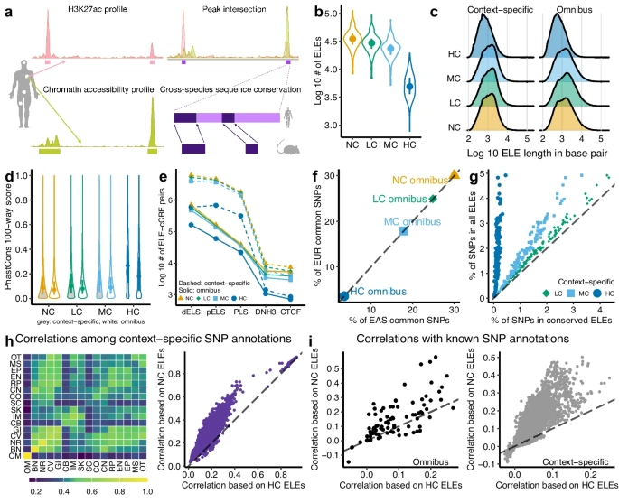
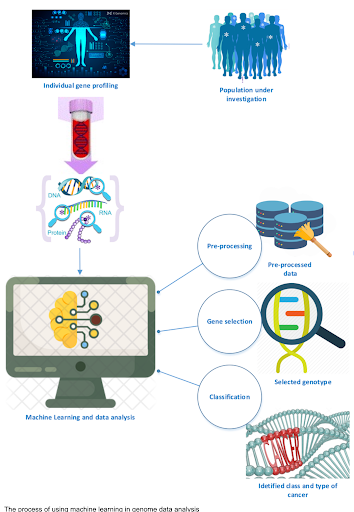
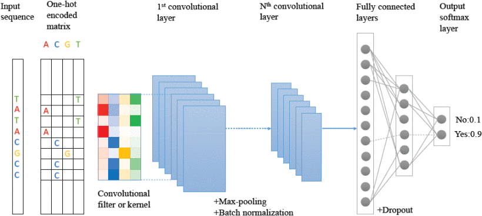

# 3. AI-Driven Analysis of Noncoding Genomic Regions

1. [Introduction](#31)
2. [GWAS Study on Enhancer Mutations](#32)
3. [AI for Noncoding Region Analysis](#33)
    3.1. [Key Features Analyzed by AI](#331)
    3.2. [AI Models and Their Applications](#332)
4. [CNNs for Enhancer Prediction](#34)
    4.1 [DeepEnhancer: A Case Study](#341)
5. [Workflow of AI-Driven Mutation Impact Prediction](#35)

## 3.1 Introduction

The human genome contains vast stretches of noncoding DNA, once considered "junk" but now recognized as crucial for gene regulation. Understanding the function of these regions and the impact of mutations within them is a major challenge. Recent advances have combined genome-wide association studies (GWAS) with artificial intelligence (AI) to shed light on these enigmatic parts of our genome.

## 3.2 GWAS Study on Enhancer Mutations

**Figure 2.** Overview of a GWAS study focusing on enhancer mutations. The study identified conserved enhancer-like elements (ELEs) across species, found them enriched in tissue-specific heritability, and prioritized genes for complex traits. The figure showcases various analyses, including chromatin accessibility, sequence conservation, and correlations between different genomic features. **Image adapted from Zhu, X., Ma, S., & Wong, W. H. (2024).**

A recent study by Zhu et al. (2024) used GWAS to investigate the effects of mutations in conserved enhancer-like elements (ELEs). The key findings include:

*   **Identification of Conserved ELEs:** 313 ELEs with regulatory activity were identified across species using 10 epigenomic datasets.
*   **Enrichment in Heritability:** ELEs were found to be enriched in tissue-specific heritability and causal variants for complex traits.
*   **Prioritization of Genes:** The study prioritized genes associated with traits like BMI and schizophrenia that were not identified in previous GWAS.

> This study demonstrates the power of GWAS in uncovering the functional importance of noncoding regions and their contribution to complex traits.

## 3.3 AI for Noncoding Region Analysis

**Figure 3.** Illustration of how AI solves the noncoding mystery. AI models analyze large genomic datasets to predict the functionality of noncoding regions and the impact of mutations. The figure depicts the flow of data from individual gene profiling to machine learning and data analysis, highlighting the role of AI in gene selection and classification.

Artificial intelligence (AI) is revolutionizing our ability to analyze noncoding regions. By learning from vast datasets, AI models can predict the function of these regions and the impact of mutations within them.

### 3.3.1 Key Features Analyzed by AI

AI models focus on several key features within noncoding DNA:

1.  **Sequence Motifs:** Patterns indicative of transcription factor binding sites.
2.  **Epigenomic Features:** Chromatin accessibility (e.g., ATAC-Seq) and other epigenetic modifications.
3.  **Gene Expression Correlation:** Relationships between noncoding regions and gene expression levels (e.g., RNA-Seq).

### 3.3.2 AI Models and Their Applications

Different AI models are employed based on the specific task:

*   **Convolutional Neural Networks (CNNs):** Effective at detecting subtle, non-linear patterns in sequence data, such as sequence motifs.
*   **Transformers:** Handle long-range dependencies, crucial for understanding interactions between distant genomic elements (e.g., enhancer-promoter interactions).

## 3.4 CNNs for Enhancer Prediction

**Figure 4.** Diagram of a CNN layer applied to a genomic sequence. The figure illustrates the process of converting a DNA sequence into a one-hot encoded matrix, followed by convolutional layers, max-pooling, and fully connected layers, ultimately leading to an output prediction. **Image adapted from Min, X., Zeng, W., Chen, S., & Chen, N. (2017).**

Convolutional Neural Networks (CNNs) have shown great promise in predicting enhancer regions within DNA sequences.

### 3.4.1 DeepEnhancer: A Case Study

The DeepEnhancer method (Min et al., 2017) exemplifies the application of CNNs in enhancer prediction:

*   **Goal:** Predict enhancer regions in DNA using CNNs.
*   **Method:** Trained on FANTOM5 data and fine-tuned with ENCODE data.
*   **Results:** Outperformed traditional methods and identified key sequence motifs.
*   **Conclusion:** Demonstrates the potential of deep learning in genomic analysis.

## 3.5 Workflow of AI-Driven Mutation Impact Prediction

The general workflow for predicting the impact of mutations using AI involves the following steps:

1.  **Data Input:** Genomic sequences and epigenomic data are used as input.
2.  **Preprocessing:**
    *   Genomic sequences are encoded (e.g., one-hot encoding).
    *   Epigenomic data are normalized.
3.  **Data Integration:** Genomic and epigenomic data are combined.
4.  **AI Model Training/Application:** CNNs and/or Transformers are trained or applied to the integrated data.
5.  **Mutation Impact Prediction:** The AI model predicts the impact of mutations on gene regulation.
6.  **Functional Insights:** The predictions provide insights into the functional consequences of mutations.

# References

*   Min, X., Zeng, W., Chen, S., & Chen, N. (2017). Predicting enhancers by convolutional neural networks. *BMC Bioinformatics*, *33*(21), 3482–3490. [https://doi.org/10.1109/BIBM.2016.7822593](https://doi.org/10.1109/BIBM.2016.7822593)
*   Zhu, X., Ma, S., & Wong, W. H. (2024). Genetic effects of sequence-conserved enhancer-like elements on human complex traits. *Genome Biology*, *25*(1), 1–20. [https://doi.org/10.1186/s13059-023-03142-1](https://doi.org/10.1186/s13059-023-03142-1)

